# Kernel-Level Threads in XV6: Design and Approach

## Problem Statement
XV6 currently supports only processes, not threads. The goal is to add kernel-level threads, allowing multiple threads of execution within a single process, sharing the same address space and resources, but with independent stacks and execution contexts.

## Solution Overview
- **Thread Structure:** Extend the process structure to support threads, or introduce a new thread structure linked to processes.
- **Thread Lifecycle:** Implement system calls for thread creation, exit, and joining (e.g., `kthread_create`, `kthread_exit`, `kthread_join`).
- **Scheduler:** Modify the scheduler to treat threads as schedulable entities.
- **Resource Sharing:** Threads within a process share memory, file descriptors, etc., but have separate stacks and registers.
- **User API:** Provide user-level wrappers for thread operations.
- **Testing:** Add user programs to test thread creation, synchronization, and resource sharing.

## Design Decisions
- Threads will be implemented as lightweight processes sharing the same address space (like Linux kernel threads).
- Each thread will have its own kernel stack, trapframe, and context.
- The process table will be extended to distinguish between processes and threads.
- Synchronization primitives (mutexes, etc.) may be added for demonstration.

## Implementation Steps
1. Update `proc.h` and `proc.c` to support threads.
2. Add new system calls for thread operations.
3. Modify the scheduler in `proc.c`.
4. Update user library and add test programs.
5. Document and polish the code.

## Threading Data Structure Extensions

### proc.h
- Added the following fields to `struct proc` to support kernel threads:
  - `is_thread`: Distinguishes threads from processes.
  - `tid`: Thread ID (unique within a process/thread group).
  - `tgid`: Thread group ID (same as PID of group leader).
  - `thread_group_leader`: Pointer to the main process (group leader).
  - `parent_thread`: Pointer to the parent thread (for join/wait semantics).
  - `ustack`: User stack pointer for this thread.

These fields allow the kernel to distinguish threads from processes, manage thread groups, and track thread-specific resources. This is the foundation for implementing kernel-level threads in XV6.

## Kernel Thread Lifecycle Implementation

### proc.c
- Implemented `kthread_create`, `kthread_exit`, and `kthread_join`:
  - `kthread_create`: Allocates a new thread in the same address space, sets up its stack and entry point, assigns a thread ID, and makes it RUNNABLE.
  - `kthread_exit`: Marks the current thread as ZOMBIE and yields the CPU.
  - `kthread_join`: Waits for a thread with a given TID in the same thread group to exit, retrieves its exit status, and cleans up.
- Threads share address space, file descriptors, and CWD with their group leader.
- Scheduler and process table logic treat threads as schedulable entities.

---

## Thread/Process Relationship Diagram

```mermaid
graph TD;
  Process((Process/Thread Group Leader))
  Thread1((Thread 1))
  Thread2((Thread 2))
  Thread3((Thread 3))
  Process -- shares address space, files, cwd --> Thread1
  Process -- shares address space, files, cwd --> Thread2
  Process -- shares address space, files, cwd --> Thread3
  Thread1 -- has own stack/context --> Thread1
  Thread2 -- has own stack/context --> Thread2
  Thread3 -- has own stack/context --> Thread3
```

---

## Scheduler Flow (Threads and Processes)

---

## Change Log
- All major kernel and user changes are documented inline above.
- See code comments for rationale and design notes.

---

## Lessons Learned & Future Work
- Kernel threads can be implemented cleanly by extending the process table.
- Future: add condition variables, semaphores, or pthread-like API for richer threading support.
